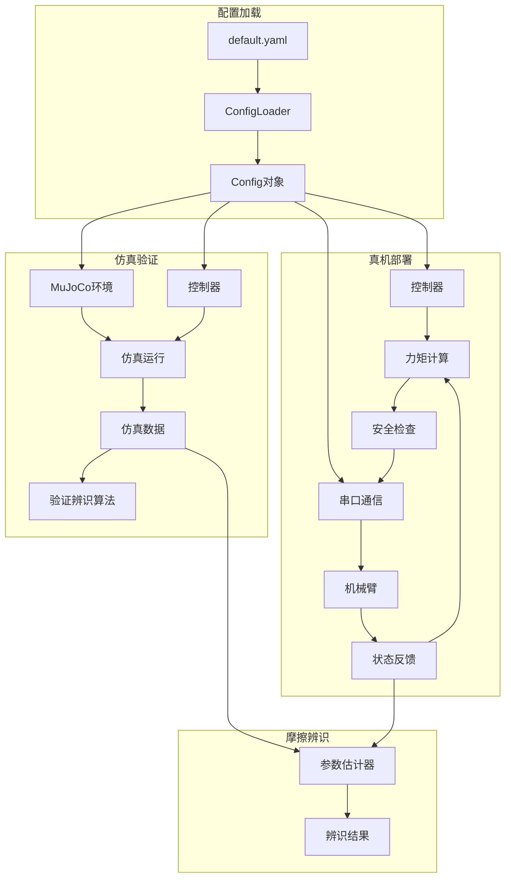
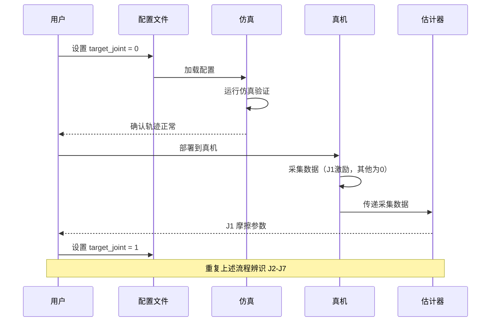

# 摩擦力辨识系统重构计划

## 一、重构目标

1. **参数统一**：仿真和真机使用完全一致的配置参数
2. **配置外部化**：使用 YAML 文件管理所有配置，便于修改和版本控制
3. **逐电机辨识**：支持一次只辨识一个电机，未参与辨识的电机力矩输出为 0
4. **控制简化**：真机只接收最终计算好的力矩，所有控制逻辑在上位机完成
5. **保护精简**：保留关节限位和力矩限幅两个核心保护，移除冗余保护逻辑
6. **代码解耦**：仿真和真机模块近乎独立，但共享核心算法和配置

## 二、当前架构问题分析

### 2.1 配置分散
- 参数硬编码在 `config.py` 的 dataclass 中
- 仿真和真机有部分重复配置
- 修改参数需要改代码

### 2.2 代码冗余
- `real_support.py` 和 `mujoco_driver.py` 有大量重复的保护逻辑
- 多层嵌套的安全检查（硬限位、软限位、工作窗、速度清零等）
- CLI 参数过多且与配置文件重复

### 2.3 耦合过紧
- 真机采集依赖 MuJoCo 生成参考轨迹
- 控制逻辑分散在多个模块中

## 三、新架构设计

### 3.1 目录结构

```
friction_identification_core/
├── config/
│   ├── default.yaml          # 默认配置模板
│   └── loader.py             # YAML 配置加载器
├── core/
│   ├── trajectory.py         # 轨迹生成（五次多项式、激励轨迹）
│   ├── controller.py         # 控制器（前馈+PD）
│   ├── estimator.py          # 摩擦参数估计器（保留现有）
│   ├── safety.py             # 精简的安全保护
│   └── models.py             # 数据模型（保留现有）
├── simulation/
│   ├── mujoco_env.py         # MuJoCo 环境封装
│   └── runner.py             # 仿真运行器
├── hardware/
│   ├── serial_protocol.py    # 串口协议（保留现有）
│   └── runner.py             # 真机运行器
├── utils/
│   ├── logging.py            # 日志工具
│   └── visualization.py      # 可视化（Rerun）
└── cli/
    ├── simulate.py           # 仿真入口
    └── deploy.py             # 真机部署入口
```

### 3.2 YAML 配置文件结构

```yaml
# config/default.yaml

# 机器人模型配置
robot:
  urdf_path: "am_d02_model/urdf/AM-D02-AemLURDF0413.urdf"
  joint_names:
    - "ArmLsecond_Joint"
    - "ArmLthird_Joint"
    - "ArmLfourth_Joint"
    - "ArmLfifth_Joint"
    - "ArmLsixth_Joint"
    - "ArmLsixthoutput_Joint"
    - "ArmLseventh_Joint"
  
  # 关节限位 [lower, upper] 弧度
  joint_limits:
    - [-0.83, 0.829]
    - [-0.819, 0.0]
    - [-1.592, 1.681]
    - [0.0, 1.523]
    - [-1.428, 1.536]
    - [-0.7384, 0.6513]
    - [-0.8899, 1.622]
  
  # 力矩限制 Nm
  torque_limits: [40.0, 40.0, 27.0, 27.0, 7.0, 7.0, 9.0]
  
  # 初始位姿
  home_qpos: [0.0, 0.0, 0.0, 0.0, 0.0, 0.0, 0.0]
  
  # TCP 偏置
  tcp_offset: [0.0, 0.07, -0.03]
  end_effector_body: "tcp"

# 仿真摩擦参数（用于验证辨识算法）
simulation_friction:
  coulomb: [0.12, 0.12, 0.10, 0.10, 0.08, 0.08, 0.08]
  viscous: [0.45, 0.45, 0.38, 0.38, 0.28, 0.26, 0.28]

# 辨识配置
identification:
  # 当前辨识的电机索引（0-6），一次只辨识一个
  target_joint: 0
  
  # 激励轨迹参数
  excitation:
    duration: 30.0           # 激励时长 秒
    base_frequency: 0.12     # 基频 Hz
    amplitude_scale: 0.22    # 幅值缩放
  
  # 起步过渡
  transition:
    max_ee_speed: 1.0        # 最大末端速度 m/s
    min_duration: 1.2        # 最短过渡时间 秒
    settle_duration: 0.25    # 稳定时间 秒

# 控制器参数
controller:
  # PD 增益
  kp: [115.0, 100.0, 35.0, 40.0, 22.0, 20.0, 20.0]
  kd: [5.0, 5.0, 2.2, 2.0, 1.0, 1.0, 1.0]
  
  # 反馈缩放
  feedback_scale: 0.2

# 安全保护
safety:
  # 关节限位安全裕度 弧度
  joint_limit_margin: 0.087  # 约 5 度
  
  # 是否启用力矩限幅
  enable_torque_clamp: true

# 采样配置
sampling:
  rate: 400.0               # 采样率 Hz
  timestep: 0.0005          # 仿真步长 秒

# 拟合参数
fitting:
  velocity_scale: 0.03
  regularization: 1.0e-8
  max_iterations: 16
  huber_delta: 1.35
  min_velocity_threshold: 0.01

# 串口配置（真机）
serial:
  port: "/dev/ttyUSB0"
  baudrate: 115200

# 可视化
visualization:
  render: true              # MuJoCo 渲染
  spawn_rerun: true         # Rerun 可视化

# 输出路径
output:
  results_dir: "results"
```

### 3.3 核心模块设计

#### 3.3.1 配置加载器 (`config/loader.py`)

```python
@dataclass
class Config:
    """统一配置对象，仿真和真机共用"""
    robot: RobotConfig
    simulation_friction: FrictionConfig
    identification: IdentificationConfig
    controller: ControllerConfig
    safety: SafetyConfig
    sampling: SamplingConfig
    fitting: FittingConfig
    serial: SerialConfig
    visualization: VisualizationConfig
    output: OutputConfig

def load_config(path: str = "config/default.yaml") -> Config:
    """加载 YAML 配置文件"""
    ...
```

#### 3.3.2 统一控制器 (`core/controller.py`)

```python
class FrictionIdentificationController:
    """前馈+PD 控制器，仿真和真机共用"""
    
    def __init__(self, config: Config):
        self.config = config
        self.target_joint = config.identification.target_joint
        
    def compute_torque(
        self,
        q_cmd: np.ndarray,
        qd_cmd: np.ndarray,
        qdd_cmd: np.ndarray,
        q_curr: np.ndarray,
        qd_curr: np.ndarray,
    ) -> np.ndarray:
        """
        计算控制力矩
        - 只有 target_joint 输出非零力矩
        - 其他关节力矩为 0
        """
        # 前馈：逆动力学
        tau_ff = self._inverse_dynamics(q_cmd, qd_cmd, qdd_cmd)
        
        # PD 反馈
        tau_fb = self.kp * (q_cmd - q_curr) + self.kd * (qd_cmd - qd_curr)
        
        # 合成
        tau = tau_ff + self.config.controller.feedback_scale * tau_fb
        
        # 只保留目标关节
        mask = np.zeros(7, dtype=bool)
        mask[self.target_joint] = True
        tau[~mask] = 0.0
        
        # 力矩限幅
        tau = np.clip(tau, -self.torque_limits, self.torque_limits)
        
        return tau
```

#### 3.3.3 精简安全模块 (`core/safety.py`)

```python
class SafetyGuard:
    """精简的安全保护，只保留两个核心功能"""
    
    def __init__(self, config: Config):
        self.joint_limits = np.array(config.robot.joint_limits)
        self.torque_limits = np.array(config.robot.torque_limits)
        self.margin = config.safety.joint_limit_margin
        
    def check_joint_limits(self, q: np.ndarray) -> bool:
        """检查关节是否在安全范围内"""
        lower = self.joint_limits[:, 0] + self.margin
        upper = self.joint_limits[:, 1] - self.margin
        return np.all((q >= lower) & (q <= upper))
    
    def clamp_torque(self, tau: np.ndarray) -> np.ndarray:
        """力矩限幅"""
        return np.clip(tau, -self.torque_limits, self.torque_limits)
    
    def get_violation_message(self, q: np.ndarray) -> str | None:
        """返回违规信息，无违规返回 None"""
        ...
```

### 3.4 工作流程



### 3.5 逐电机辨识流程



## 四、重构步骤

### 阶段一：配置系统重构
1. 创建 `config/default.yaml` 配置文件
2. 实现 `config/loader.py` 配置加载器
3. 移除 `config.py` 中的硬编码参数

### 阶段二：核心模块重构
4. 重构 `core/trajectory.py` - 提取轨迹生成逻辑
5. 重构 `core/controller.py` - 统一控制器实现
6. 重构 `core/safety.py` - 精简安全保护

### 阶段三：仿真模块重构
7. 重构 `simulation/mujoco_env.py` - 简化 MuJoCo 封装
8. 重构 `simulation/runner.py` - 仿真运行器

### 阶段四：真机模块重构
9. 重构 `hardware/runner.py` - 真机运行器
10. 简化串口通信逻辑

### 阶段五：CLI 和集成
11. 重构 CLI 入口，简化参数
12. 集成测试
13. 文档更新

## 五、保留的核心功能

1. **轨迹生成**：五次多项式点到点轨迹、分段激励轨迹
2. **控制器**：前馈（逆动力学）+ PD 反馈
3. **摩擦估计**：鲁棒最小二乘拟合
4. **安全保护**：关节限位检测、力矩限幅
5. **可视化**：MuJoCo 渲染、Rerun 数据可视化

## 六、移除的冗余功能

1. 多层嵌套的限位检查（硬限位、软限位、工作窗）
2. 速度相关的力矩清零逻辑
3. 力矩整形（scale_factors）
4. 重复的 CLI 参数
5. 多种执行模式（preview_startup_only, bias_compensation_only 等）

## 七、接口变更

### 7.1 CLI 简化

**仿真**：
```bash
python -m friction_identification_core.cli.simulate --config config/default.yaml
```

**真机**：
```bash
python -m friction_identification_core.cli.deploy --config config/default.yaml --mode collect
python -m friction_identification_core.cli.deploy --config config/default.yaml --mode compensate
```

### 7.2 配置修改

修改辨识目标电机只需编辑 YAML：
```yaml
identification:
  target_joint: 0  # 改为 1, 2, 3... 辨识不同电机
```

## 八、风险和注意事项

1. **兼容性**：重构后旧的结果文件格式可能需要适配
2. **测试**：需要在仿真中充分验证后再部署真机
3. **安全**：虽然简化了保护逻辑，但关节限位和力矩限幅是必须保留的
4. **回滚**：建议在新分支上进行重构，保留原有代码作为参考
