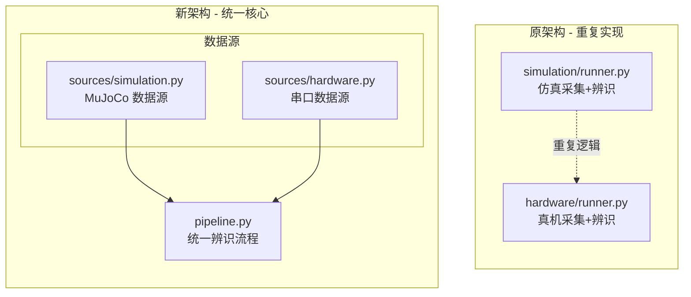
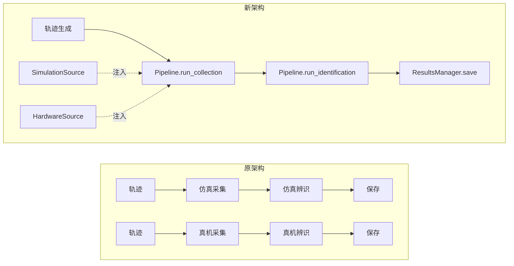

# 摩擦力辨识项目架构简化方案

## 一、现有架构分析

### 当前目录结构
```
friction_identification_core/
├── __init__.py
├── README.md
├── cli/                    # 2 文件
│   ├── __init__.py
│   ├── deploy.py
│   └── simulate.py
├── config/                 # 2 文件
│   ├── __init__.py
│   ├── default.yaml
│   └── loader.py
├── core/                   # 6 文件
│   ├── __init__.py
│   ├── compensation.py
│   ├── controller.py
│   ├── estimator.py
│   ├── models.py
│   ├── safety.py
│   └── trajectory.py
├── hardware/               # 2 文件
│   ├── __init__.py
│   ├── runner.py
│   └── serial_protocol.py
├── simulation/             # 2 文件
│   ├── __init__.py
│   ├── mujoco_env.py
│   └── runner.py
└── utils/                  # 3 文件
    ├── __init__.py
    ├── logging.py
    ├── mujoco.py
    └── visualization.py
```

### 现有问题
1. **子文件夹过多**：6 个子文件夹，每个仅 2-3 个文件
2. **CLI 分散**：simulate.py 和 deploy.py 分开，功能重叠
3. **结果文件混乱**：每个关节生成独立的 .json + .npz，文件数量爆炸
4. **`__init__.py` 冗余**：每个子文件夹都需要 `__init__.py`
5. **仿真/真机代码重复**：数据采集和计算逻辑在两处重复实现

---

## 二、简化后的架构

### 核心设计理念

**仿真和真机共享同一套数据采集和计算核心，只是数据源（DataSource）不同。**

```
┌─────────────────────────────────────────────────────────────┐
│                    统一辨识流程 (Pipeline)                    │
│  ┌──────────┐   ┌──────────┐   ┌──────────┐   ┌──────────┐ │
│  │ 轨迹生成  │ → │ 数据采集  │ → │ 摩擦估计  │ → │ 结果保存  │ │
│  └──────────┘   └──────────┘   └──────────┘   └──────────┘ │
│                       ↑                                      │
│              ┌────────┴────────┐                            │
│              │   DataSource    │                            │
│         ┌────┴────┐      ┌────┴────┐                       │
│         │ 仿真源   │      │ 真机源   │                       │
│         │ MuJoCo  │      │ Serial  │                       │
│         └─────────┘      └─────────┘                       │
└─────────────────────────────────────────────────────────────┘
```

### 新目录结构
```
friction_identification_core/
├── __init__.py
├── __main__.py             # 统一 CLI 入口
├── config.py               # 配置加载
├── default.yaml            # 默认配置
├── models.py               # 数据模型 + DataSource 协议
├── estimator.py            # 摩擦力估计算法
├── controller.py           # 控制器 + 安全 + 补偿
├── trajectory.py           # 轨迹生成
├── pipeline.py             # 统一辨识流程 (新增核心)
├── sources/                # 数据源实现 (唯一子文件夹)
│   ├── __init__.py
│   ├── simulation.py       # MuJoCo 仿真数据源
│   └── hardware.py         # 串口真机数据源
├── visualization.py        # 可视化
└── results.py              # 结果管理
```

### 文件数量对比
| 项目 | 原架构 | 新架构 |
|------|--------|--------|
| 子文件夹 | 6 | 1 (sources/) |
| Python 文件 | 17 + 6 个 `__init__.py` = 23 | 13 |
| 配置文件 | 1 | 1 |

---

## 三、核心抽象：DataSource 协议

### 3.1 DataSource 协议定义

仿真和真机的唯一区别是数据来源，通过 Protocol 抽象：

```python
from typing import Protocol

class DataSource(Protocol):
    """数据源协议 - 仿真和真机的统一接口"""
    
    def initialize(self, config: Config) -> None:
        """初始化数据源"""
        ...
    
    def get_state(self) -> tuple[np.ndarray, np.ndarray]:
        """获取当前状态 (q, qd)"""
        ...
    
    def apply_torque(self, tau: np.ndarray) -> None:
        """施加力矩"""
        ...
    
    def get_measured_torque(self) -> np.ndarray:
        """获取测量力矩 (真机) 或计算摩擦力矩 (仿真)"""
        ...
    
    def step(self) -> bool:
        """推进一步，返回是否继续"""
        ...
    
    def close(self) -> None:
        """释放资源"""
        ...
```

### 3.2 `pipeline.py` - 统一辨识流程 (核心)

```python
class IdentificationPipeline:
    """统一的摩擦力辨识流程"""
    
    def __init__(
        self,
        config: Config,
        source: DataSource,
        controller: FrictionIdentificationController,
    ) -> None:
        self.config = config
        self.source = source
        self.controller = controller
        self.collector = DataCollector()
    
    def run_collection(self, reference: ReferenceTrajectory) -> CollectedData:
        """执行数据采集 - 仿真和真机共用"""
        self.source.initialize(self.config)
        
        for t, q_cmd, qd_cmd, qdd_cmd in reference.iterate():
            q, qd = self.source.get_state()
            tau = self.controller.compute_torque(q_cmd, qd_cmd, qdd_cmd, q, qd)
            self.source.apply_torque(tau)
            
            if not self.source.step():
                break
            
            tau_measured = self.source.get_measured_torque()
            self.collector.record(t, q, qd, tau_measured, tau)
        
        self.source.close()
        return self.collector.finalize()
    
    def run_identification(self, data: CollectedData) -> IdentificationResult:
        """执行摩擦力辨识 - 仿真和真机共用"""
        return fit_multijoint_friction(
            velocity=data.qd,
            torque=data.tau_friction,
            ...
        )
    
    def run_full(self) -> IdentificationResult:
        """完整流程：采集 + 辨识"""
        reference = build_excitation_trajectory(self.config)
        data = self.run_collection(reference)
        return self.run_identification(data)
```

### 3.3 数据源实现

**`sources/simulation.py` - MuJoCo 仿真源**
```python
class SimulationSource:
    """MuJoCo 仿真数据源"""
    
    def __init__(self, config: Config):
        self.env = MujocoEnvironment(config)
    
    def get_state(self) -> tuple[np.ndarray, np.ndarray]:
        return self.env.get_joint_state()[:2]
    
    def apply_torque(self, tau: np.ndarray) -> None:
        self.env.set_torque(tau)
    
    def get_measured_torque(self) -> np.ndarray:
        # 仿真中直接获取摩擦力矩
        return self.env.get_friction_torque()
    
    def step(self) -> bool:
        self.env.step()
        return True
```

**`sources/hardware.py` - 串口真机源**
```python
class HardwareSource:
    """串口真机数据源"""
    
    def __init__(self, config: Config):
        self.serial = SerialConnection(config.serial)
        self.dynamics = RigidBodyDynamics(config)
    
    def get_state(self) -> tuple[np.ndarray, np.ndarray]:
        frame = self.serial.read_frame()
        return frame.position, frame.velocity
    
    def apply_torque(self, tau: np.ndarray) -> None:
        self.serial.send_torque(tau)
    
    def get_measured_torque(self) -> np.ndarray:
        # 真机需要从测量力矩减去刚体动力学
        tau_measured = self.serial.read_frame().torque
        tau_rigid = self.dynamics.inverse(self.q, self.qd, self.qdd)
        return tau_measured - tau_rigid
    
    def step(self) -> bool:
        return self.serial.wait_next_frame()
```

### 3.4 `__main__.py` - 统一 CLI 入口

```bash
# 统一命令格式
python -m friction_identification_core run --source sim --mode collect
python -m friction_identification_core run --source hw --mode collect
python -m friction_identification_core run --source hw --mode compensate

# 通用参数
--config PATH       # 配置文件路径
--joint N           # 目标关节 (1-7)
--output PATH       # 结果输出路径
--source sim|hw     # 数据源类型
--mode collect|compensate|full_feedforward
```

### 3.5 `controller.py` - 控制器模块

合并以下文件：
- `core/controller.py` - FrictionIdentificationController
- `core/safety.py` - SafetyGuard
- `core/compensation.py` - 补偿计算函数

### 3.6 `results.py` - 结果管理模块

```python
@dataclass
class IdentificationResults:
    """统一的辨识结果容器"""
    source_type: str                    # simulation / hardware
    timestamp: str                      # ISO 8601 时间戳
    config_snapshot: dict               # 配置快照
    joints: dict[int, JointResult]      # 各关节结果
    raw_data: dict[str, np.ndarray]     # 原始数据

@dataclass
class JointResult:
    """单关节辨识结果"""
    joint_index: int
    joint_name: str
    coulomb: float
    viscous: float
    offset: float
    velocity_scale: float
    validation_rmse: float
    validation_r2: float
    sample_count: int

class ResultsManager:
    """结果管理器"""
    def save(self, results: IdentificationResults, path: Path) -> None: ...
    def load(self, path: Path) -> IdentificationResults: ...
    def append_joint(self, path: Path, joint_result: JointResult) -> None: ...
    def get_summary(self, path: Path) -> dict: ...
```

---

## 四、结果保存优化

### 4.1 现有问题

当前每次辨识生成大量文件：
```
results/
├── friction_identification_joint_1.json
├── friction_identification_joint_1.npz
├── friction_identification_joint_2.json
├── friction_identification_joint_2.npz
├── ... (每个关节 2 个文件)
├── real_uart_capture_collect_joint_1.json
├── real_uart_capture_collect_joint_1.npz
├── ... (真机采集也是每关节 2 个文件)
└── real_friction_identification_summary.json
```

### 4.2 优化方案

合并为单文件存储：

```
results/
├── simulation_results.npz      # 仿真结果 (所有关节)
└── hardware_results.npz        # 真机结果 (所有关节)
```

### 4.3 NPZ 文件结构

```python
# simulation_results.npz 内部结构
{
    # 元数据 (JSON 字符串)
    "metadata": '{"mode": "simulation", "timestamp": "...", ...}',
    
    # 各关节辨识参数
    "coulomb": [fc1, fc2, ..., fc7],
    "viscous": [fv1, fv2, ..., fv7],
    "offset": [o1, o2, ..., o7],
    "velocity_scale": [vs1, vs2, ..., vs7],
    "validation_rmse": [rmse1, ..., rmse7],
    "validation_r2": [r2_1, ..., r2_7],
    
    # 原始采样数据 (可选，按需保存)
    "time": [...],
    "q": [[...], ...],           # shape: (N, 7)
    "qd": [[...], ...],
    "tau_measured": [[...], ...],
    "tau_predicted": [[...], ...],
}
```

### 4.4 增量更新支持

支持逐关节辨识后追加结果：

```python
manager = ResultsManager()

# 第一次运行 - 辨识关节 1
result_j1 = run_identification(joint=0)
manager.save(result_j1, "results/hardware_results.npz")

# 第二次运行 - 辨识关节 2，追加到同一文件
result_j2 = run_identification(joint=1)
manager.append_joint("results/hardware_results.npz", result_j2)
```

---

## 五、架构对比图



### 数据流对比



---

## 六、实施步骤

### 阶段 1：创建核心抽象
- [ ] 在 `models.py` 中定义 `DataSource` Protocol
- [ ] 创建 `pipeline.py` 统一辨识流程
- [ ] 创建 `results.py` 结果管理

### 阶段 2：实现数据源
- [ ] 创建 `sources/` 目录
- [ ] 实现 `sources/simulation.py` - MuJoCo 数据源
- [ ] 实现 `sources/hardware.py` - 串口数据源

### 阶段 3：合并模块
- [ ] 创建 `config.py` 合并配置加载
- [ ] 创建 `controller.py` 合并控制+安全+补偿
- [ ] 迁移 `estimator.py`
- [ ] 迁移 `trajectory.py`
- [ ] 迁移 `visualization.py`

### 阶段 4：统一入口
- [ ] 创建 `__main__.py` 统一 CLI
- [ ] 更新 `__init__.py` 导出

### 阶段 5：测试和清理
- [ ] 测试仿真流程
- [ ] 测试真机流程
- [ ] 删除旧的子文件夹
- [ ] 更新 README.md

---

## 七、兼容性说明

### 保留的公开 API
```python
from friction_identification_core import (
    Config,
    load_config,
    FrictionIdentificationController,
    SafetyGuard,
    fit_multijoint_friction,
    # ... 其他现有导出
)
```

### 新增的 API
```python
from friction_identification_core import (
    # 核心抽象
    DataSource,
    IdentificationPipeline,
    
    # 数据源
    SimulationSource,
    HardwareSource,
    
    # 结果管理
    ResultsManager,
    IdentificationResults,
    JointResult,
)
```

### 命令行变更
```bash
# 旧命令
python -m friction_identification_core.cli.simulate
python -m friction_identification_core.cli.deploy

# 新命令 (统一格式)
python -m friction_identification_core run --source sim --mode collect
python -m friction_identification_core run --source hw --mode collect
```

---

## 八、优势总结

| 方面 | 原架构 | 新架构 |
|------|--------|--------|
| 代码复用 | 仿真/真机各自实现采集和辨识 | 共享 Pipeline 核心 |
| 扩展性 | 新增数据源需要复制大量代码 | 只需实现 DataSource 接口 |
| 测试 | 需要分别测试仿真和真机 | 可用 Mock DataSource 单元测试 |
| 维护 | 修改逻辑需要改两处 | 只改 Pipeline 一处 |
| 文件数 | 23 个 | 13 个 |
| 子文件夹 | 6 个 | 1 个 |
